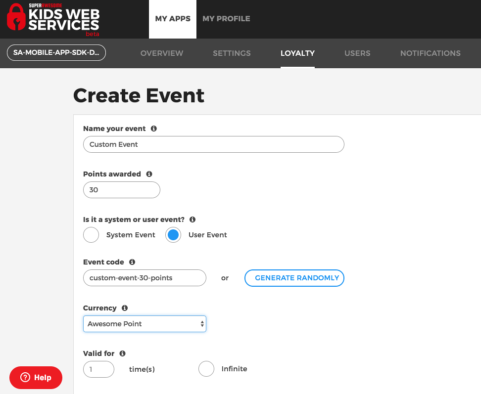

Trigger event
=============

Kids Web Services allows you to define custom events in the Control Panel through which you can add or subtract points for users.

Events are defined on a per-app basis.

You can trigger an event for the user you're authenticated as by calling:

.. code-block:: java

  KWS.sdk.triggerEvent (MainActivity, "app-data", 15, "", new KWSTriggerEventInterface() {
    @Override
    public void triggered (boolean success) {
      // handle success
	  }
  });

The method has the following parameters:

=========== ======= =======
Parameter   Type    Meaning
=========== ======= =======
event       String  The event code, as defined in the Control Panel
points      Integer Optional number of points to be awarded
description String  Optional description
=========== ======= =======

The callback will pass the following value on completion:

======= ==== =======
Value   Type Meaning
======= ==== =======
success Bool wether the network operation succeeded
======= ==== =======
