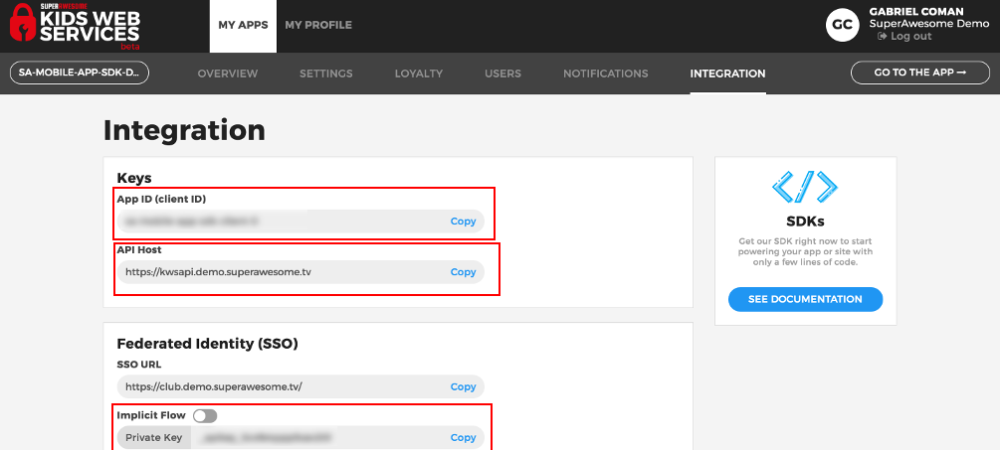

Start a new KWS session
=======================

In order to be able to use the Kids Web Services SDK you'll first have to setup a session.

Setup session
-------------

A session is defined by

	* a client ID
	* a client Secret
	* a back-end API URL to connect to

To set it up you will have to call:

.. code-block:: java

  private static final String CLIENT_ID     @"id"
  private static final String CLIENT_SECRET @"client_secret"
  private static final String API           @"kws_api"

  KWS.sdk.startSession (CLIENT_ID, CLIENT_SECRET, API);

You can obtain the Client Id, Client Secret and API host from the **Integration** section of your Kids Web Services Control Panel.

They should be different for each app you have.

Once you've setup your SDK session, it's time to authenticate as a user. All of of the functionality of the SDK assumes you're
logged in as a user.

Authenticating as user
----------------------

To authenticate as a user you'll have to call:

.. code-block:: java

  KWS.sdk.authenticateUser (MainActivity,
                            "username",
                            "password",
                            new KWSAuthUserProcessInterface ()
  {
    @Override
    public void userAuthenticated(KWSAuthUserStatus status) {

      switch (status) {
        case Success:
          // authenticated OK
          break;
        case NetworkError:
          // one of the credentials was not valid
          break;
        case InvalidCredentials:
          // there was a network error
          break;
      }
    }
  });

The callback will pass the following values on completion:

====== ================= ======
Value  Type              Meaning
====== ================= ======
status KWSAuthUserStatus End status of the operation
====== ================= ======

The **status** parameter may have the following values:

================== ======
Value              Meaning
================== ======
Success            User was authenticated successfully
InvalidCredentials The username or password were incorrect
NetworkError       Other network error
================== ======

Creating a new user
-------------------

If there are no valid users, you can create a new one by calling:

.. code-block:: objective-c

  KWS.sdk.createUser(MainActivity,
                     "username",
                     "password",
                     "2011-03-02",
                     "US",
                     "dev.gabriel.coman@gmail.com",
                     new KWSCreateUserProcessInterface ()
  {
    @Override
    public void userCreated(KWSCreateUserStatus status) {

      switch (status) {
        case Success:
          // create new user OK
          break;
        case DuplicateUsername:
          // another user has the same username
          break;
        case NetworkError:
          // other network error
          break;
      }
    }
  });

The callback will pass the following values on completion:

======= =================== ======
Value   Type                Meaning
======= =================== ======
status  KWSCreateUserStatus End status of the operation
======= =================== ======

The **status** parameter may have the following values:

================== ======
Value              Meaning
================== ======
Success            User was authenticated successfully
InvalidUsername    Chosen username contains invalid characters
InvalidPassword    Password is less than 8 characters
InvalidDateOfBirth Date should have YYYY-MM-DD format
InvalidCountry     Country should have CC format
InvalidParentEmail Parent email is invalid
DuplicateUsername  The username is already in use
NetworkError       Other network error
InvalidOperation   Other invalid operation
================== ======

From here on you'll be able to check leaderboards, assign points, enable remote notifications, set app data, etc.

Persisting the session
----------------------

Once a user is either created or authenticated, KWS will keep the user for 24 hours in user prefferrences or system defaults.

You can access the basic logged user details by calling:

.. code-block:: java

  KWSLoggedUser currentUser = KWS.sdk.getLoggedUser ();

The **KWSUser** object has the following fields:

====================== ===================== =======
Field                  Type                  Meaning
====================== ===================== =======
id                     Integer               Unique Id of the user
username               String                Username for this app only
dateOfBirth            String                Date of birth of user
country                String                Two letter country designation
parentEmail            String                Users' parent email
accessToken            String                OAuth access token
token                  String                OAuth final token
expiresIn              Integer               Milliseconds till expiration
loginDate              Long                  Last login date
metadata               KWSMetadata           Metadata object
====================== ===================== =======

The **KWSMetadata** object has the following fields:

======== ======= =======
Field    Type    Meaning
======== ======= =======
userId   Integer Unique Id of the user
appId    Integer App Id the user is logged on
clientId String  Client Id of the app
scope    String  Current scope
iat      Integer
exp      Integer Date of expiration (in milliseconds)
iss      Integer
======== ======= =======
