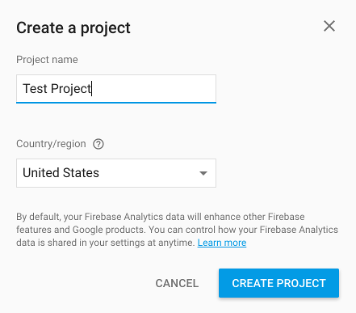
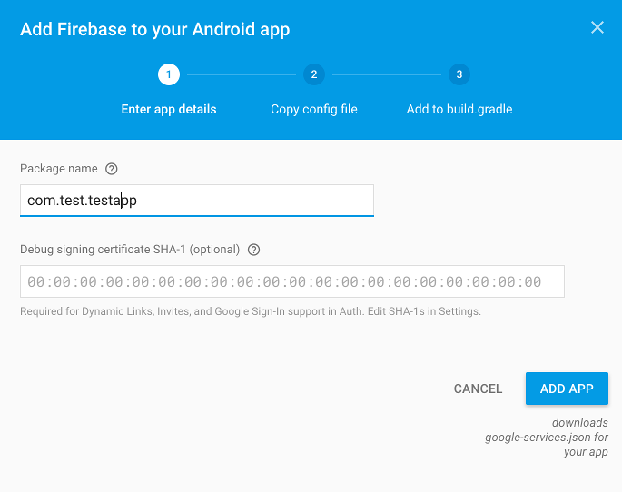
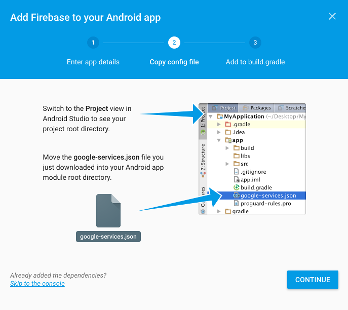

Firebase
========

To handle Remote Notifications, Kids Web Services uses the Google service called `Firebase <https://firebase.google.com/>`_.

To be able to properly integrate it you'll have to setup a new Project `Firebase Console <https://console.firebase.google.com/>`_.

Then you'll have to add a new Android Project:

This will generate a new **GoogleService-Info.plist** file that you'll have to add to your XCode project root.

Finally you'll have to add new dependencies:

In your Project **build.gradle** file add:

.. code-block:: shell

  buildscript {
    repositories {
      jcenter()
    }
    dependencies {
      // other classpaths ...
      classpath 'com.google.gms:google-services:3.0.0'
    }
  }

Next in your module (or app) **build.gradle** file add:

.. code-block:: shell

  dependencies {
    // other dependencies ..
    compile 'com.google.firebase:firebase-messaging:9.0.2'
  }

  // apply GMS plugin
  apply plugin: 'com.google.gms.google-services'

Once these steps are completed successfully you can go to the next section to see how to work with Remote Notifications through Kids Web Services.

.. note::

  You can find more information about Firebase `here <https://firebase.google.com/docs//>`_.
