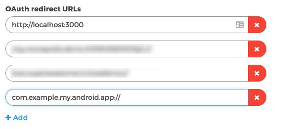

Authenticating a user
=====================

To be able to authenticated (login or create) a user through the OAuth Implicit flow you must follow the next steps:

Enable Implicit Flow in the Control Panel
-----------------------------------------

The first step is to enable Implicit Flow in your Kids Web Services Control Panel.

- Head over to the **Integration** section of your app
- Under the **User Authentication (Single Sign On)** section enable **Implicit Flow**

.. image:: img/oauth_1.png

.. note:: Please take a note of the **SSO (Single Sign On) URL** because you will need it later.

Add OAuth redirect URLs
-----------------------

The second step, once you've enabled Implicit Flow, is to add **OAuth Redirect URLs** to the Control Panel.

Where **com.example.my.android.app** is the Package name of your Android app, as defined in your Manifest file.

Modify you Manifest file
------------------------

The third step is to add a new Activity in your Android Manifest file:

.. code-block:: xml

    <activity
      android:name="kws.superawesome.tv.kwssdk.base.webauth.KWSWebAuthResponse"
      android:exported="true"
      android:launchMode="singleTask">
        <intent-filter>
          <action android:name="android.intent.action.VIEW" />
          <category android:name="android.intent.category.DEFAULT" />
          <category android:name="android.intent.category.BROWSABLE" />
          <data android:scheme="__YOUR_PACKAGE_NAME__"/>
        </intent-filter>
    </activity>

This will allow your Android app to receive and parse the response back from the authentication process.

.. note:: Please note that __YOUR_PACKAGE_NAME__ must be replaced with your actual Android application Package Name, the same one you added in the Kids Web Services Control Panel earlier on. In our case it would be **com.example.my.android.app**

Call authentication method
--------------------------

Finally, once the prerequisite steps have been completed you can call the SDK method that will initialise the authentication process.

To do so we'll use the **SSO (Single Sign On) URL** obtained from the Kids Web Services Control Panel earlier on.

For our example, that should be something like **https://my.cluser.accounts.kws.superawesome.tv/**.

.. code-block:: java

    // this function takes the SSO URL as the first parameter
    // and an Activity instance as the second parameter
    // as well as a callback listener as the third parameter
    KWSChildren.sdk.authUser("https://my.cluser.accounts.kws.superawesome.tv/",
                             this,
                             new KWSChildrenLoginUserInterface()
    {
      @Override
      public void didLoginUser (KWSChildrenLoginUserStatus status) {

        switch (status) {
          case Success:
            // authenticated OK
            break;
          case NetworkError:
            // one of the credentials was not valid
            break;
          case InvalidCredentials:
            // there was a network error
            break;
        }
      }
    });

The callback will pass the following values on completion:

====== ========================== ======
Value  Type                       Meaning
====== ========================== ======
status KWSChildrenLoginUserStatus End status of the operation
====== ========================== ======

The **status** parameter may have the following values:

================== ======
Value              Meaning
================== ======
Success            User was authenticated successfully
InvalidCredentials The username or password were incorrect
NetworkError       Other network error
================== ======
