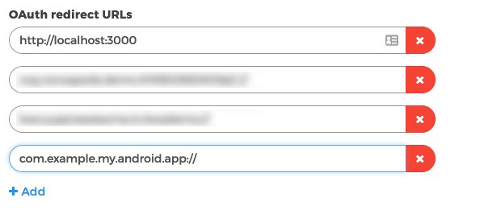

Creating and authenticating a user
==================================

Having seen the different types of callback you can get with the SDK, we'll be starting with actual implementations of the functionalities.

KWS brandable view
^^^^^^^^^^^^^^^^^^

To be able to authenticate or create a user through a KWS brandable view you must follow the next steps:

Enable Implicit Flow in the Control Panel
-----------------------------------------

The first step is to enable Implicit Flow in your Kids Web Services Control Panel.

- Head over to the **Integration** section of your app
- Under the **User Authentication (Single Sign On)** section enable **Implicit Flow**

.. image:: img/oauth_1.png

.. note:: Please take a note of the **SSO (Single Sign On) URL** because you will need it later.

Add OAuth redirect URLs
-----------------------

The second step, once you've enabled Implicit Flow, is to add **OAuth Redirect URLs** to the Control Panel.

Where **com.example.my.android.app** is the Package name of your Android app, as defined in your Manifest file.

Modify you Manifest file
------------------------

The third step is to add a new Activity in your Android Manifest file:

.. code-block:: xml

    <activity
      android:name="kws.superawesome.tv.kwssdk.authentication.webauth.WebAuthController"
      android:exported="true"
      android:launchMode="singleTask">
        <intent-filter>
          <action android:name="android.intent.action.VIEW" />
          <category android:name="android.intent.category.DEFAULT" />
          <category android:name="android.intent.category.BROWSABLE" />
          <data android:scheme="__YOUR_PACKAGE_NAME__"/>
        </intent-filter>
    </activity>

This will allow your Android app to receive and parse the response back from the authentication process.

.. note:: Please note that __YOUR_PACKAGE_NAME__ must be replaced with your actual Android application Package Name, the same one you added in the Kids Web Services Control Panel earlier on. In our case it would be **com.example.my.android.app**

Call authentication method
--------------------------

Finally, once the prerequisite steps have been completed you can call the SDK method that will initialise the authentication process.

To do so we'll use the **SSO (Single Sign On) URL** obtained from the Kids Web Services Control Panel earlier on.

For our example, that should be something like **https://my.cluster.accounts.kws.superawesome.tv/**.

The **interface service** for this is the **ISingleSignOnService** and the functionality to use is the:

  * **signOn**

This function will take: 

============== ========== ========
Field          Type       Meaning
============== ========== ========
url            String     The base URL String for the SSO flow
parent         Activity   The current activity instance
============== ========== ========

As such:

.. code-block:: java

    val myEnvironment = MyEnvironment()    
    val sdk = ComplianceSDK(myEnvironment)
    val singleSignOnService = sdk.getService(type = ISingleSignOnService::class.java)

    val url = "https://my.cluster.accounts.kws.superawesome.tv/"

    singleSignOnService?.signOn(url = url, parent = this) { user, error ->

      if (user != null) {
        //Success! We have a valid user
      } else {
        //Uh-oh! It seems there's an error...
      }
    }

The callback will pass the following values on completion:

============== ================== =========
Value           Type              Meaning
============== ================== =========
user            ILoggedUserModel  If non-null, the SDK was able to authenticate the user
error           Throwable         If non-null, an error occurred
============== ================== =========

The **ILoggedUserModel** parameter will have the following values:

============== ======== =========
Field           Type    Meaning
============== ======== =========
token          String   The valid session token of the user
id             Int      The identifier of the user (when creating a user)
============== ======== =========

Native view
^^^^^^^^^^^

To be able to authenticate and create a user using your own native views you can use the following:

Creating a user
---------------

The **interface service** to use is the **IAuthService** and the method to call is:
  
  * **createUser**

And it will take:

============== ======== ========
Field          Type     Meaning
============== ======== ========
username       String   The desired username for the new user
password       String   The desired password for the new user
timeZone       String   The time zone - **ALWAYS** null
dateOfBirth    String   The date of birth for the new user
country        String   The country code for the new user
parentEmail    String   The parent email of the new user
============== ======== ========

As such:

.. code-block:: java

  //'timeZone' is a value that the KWS API will not support at the moment, needs to be set as null

  val myEnvironment = MyEnvironment()
  val sdk = ComplianceSDK(myEnvironment)
  val authService = sdk.getService(type = IAuthService::class.java)

  authService?.createUser(username = "username", password = "password", timeZone = null, dateOfBirth = "2012-02-02", country = "US", parentEmail = "parent@test.com") { user, error ->

    if (user != null) {
      //Success! We have a valid user
    } else {
      //Uh-oh! It seems there's an error...
    }
    
  }

The callback will pass the following values on completion:

============== ================== ========
Value           Type              Meaning
============== ================== ========
user            ILoggedUserModel  If non-null, the SDK was able to create an authenticate the user
error           Throwable         If non-null, an error occurred
============== ================== ========

The **ILoggedUserModel** parameter will have the following values:

============== ======= =========
Field           Type    Meaning
============== ======= =========
token          String   The valid session token of the user
id             Int      The identifier of the user
============== ======= =========

From here on you'll be able to check leaderboards, assign points, enable remote notifications, set app data, etc.

Login user
----------

To login as a user programmatically, you need to use the **interface service** named **IAuthService** and the method to call is:

  * **loginUser**

And it will take:

============== ======== ========
Field          Type     Meaning
============== ======== ========
username       String   The user's username
password       String   The user's password 
============== ======== ========

As such:

.. code-block:: java

  val myEnvironment = MyEnvironment()
  val sdk = ComplianceSDK(myEnvironment)
  val authService = sdk.getService(type = IAuthService::class.java)

  authService?.loginUser(username = "username", password = "password") { user, error ->
    
    if (user != null) {
      //Success! We have a valid user
    } else {
      //Uh-oh! It seems there's an error...
    }

  }

The callback will pass the following values on completion:

============== ================== ========
Value           Type              Meaning
============== ================== ========
user            ILoggedUserModel  If non-null, the SDK was able to authenticate the user
error           Throwable         If non-null, an error occurred
============== ================== ========

The **ILoggedUserModel** parameter will have the following values:

============== ======== ========
Field           Type    Meaning
============== ======== ========
token          String   The valid session token of the user
============== ======== ========

From here on you'll be able to check leaderboards, assign points, enable remote notifications, set app data, etc.

The authentication token
^^^^^^^^^^^^^^^^^^^^^^^^

The type of tokens used in the Kids Web Service are `JWT Tokens <https://jwt.io/introduction/>`_.

Next, we'll be describing how to read data from the retrieved token and how to handle a session with the Kids Web Service SDK.
