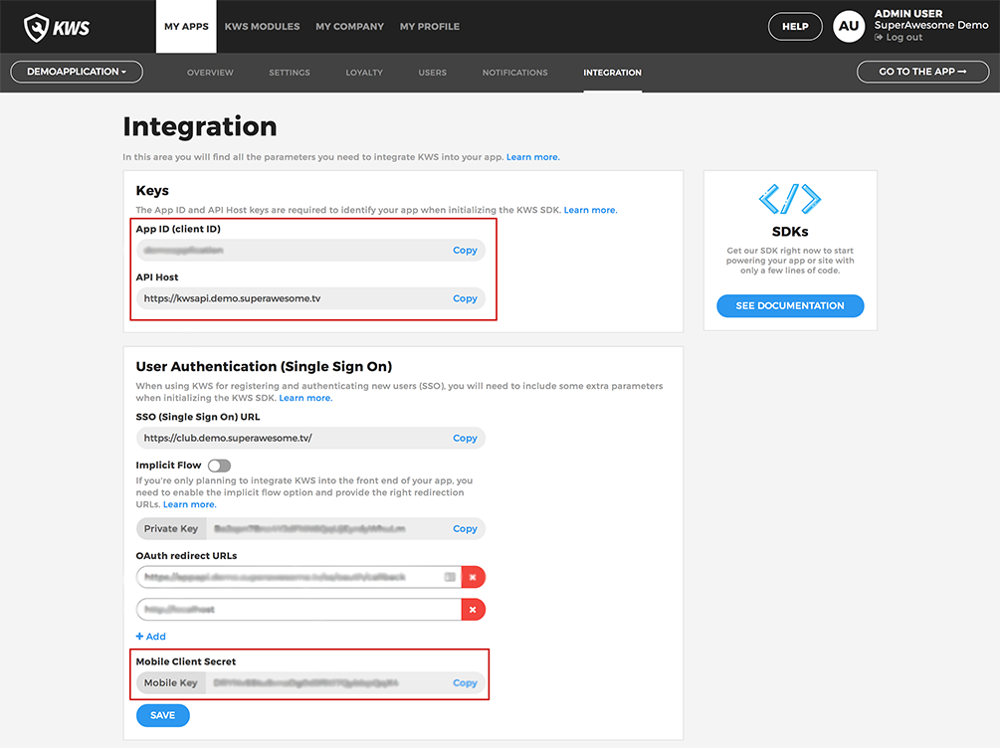

Initialise the SDK
==================

Environment
^^^^^^^^^^^

As mentioned before, in order to be able to use the Kids Web Services SDK, there's the need of an **environment** and a **interface service**.

Your custom environment 
-----------------------

For the **environment**, you'll first have to initialise it with the following values:

	* API Host - to be used as **domain**
	* App ID (client ID) - to be used as **clientID**
	* Mobile Client Secret - to be used as **clientSecret**

You can obtain these credentials from the **Integration** section of your Kids Web Services Control Panel:

They should be different for each app you have.

.. note::

	For the sake of this example, the values considered will be:

	* **domain** - "https://kwsapi.demo.superawesome.tv/"
	* **clientID** - "client_id"
	* **clientSecret** - "client_secret"

Assuming these config values, you should create a data class environment that extends from the Compliance SDK's **NetworkEnvironment**. 

Our suggestion of an implementation is as follows:

.. code-block:: java

	data class MyEnvironment(override val domain: String = "https://kwsapi.demo.superawesome.tv",
	                         override val clientID: String = "client_id",
	                         override val clientSecret: String = "client_secret") : NetworkEnvironment
	                         

Interface Services
^^^^^^^^^^^^^^^^^^

Having a generic environment for the Kids Web Service SDK, it's time to understand how to use the **interface services** in your app.

The **interface services** will provide visibility to the SDK, displaying the available functionalities. 

This is a list of the available **interface services**:

* **ISingleSignOnService** - Web Auth flow
* **IAuthService** - in app authentication
* **IUsernameService** - username details
* **IUserService** - user details
* **IUserActionsService** - user related actions
* **IScoringService** - scoring details
* **ISessionService** - user session local cache

.. note::
	More information regarding each functionality is available in the specific page that it relates to.

Using the KWS SDK 
^^^^^^^^^^^^^^^^^

Then, as seen before, the pattern to follow is:

.. code-block:: java

	val myEnvironment = MyEnvironment() //your environment
	val complianceSDK = ComplianceSDK(myEnvironment) //initialize the ComplianceSDK class
	val myService = complianceSDK.getService(type = IMyService::class.java) //get the 'IService' with desired functionalities
	  
	myService.methodCall() //call the method

The next order of business is understanding the types of callback we can get when using the SDK.
